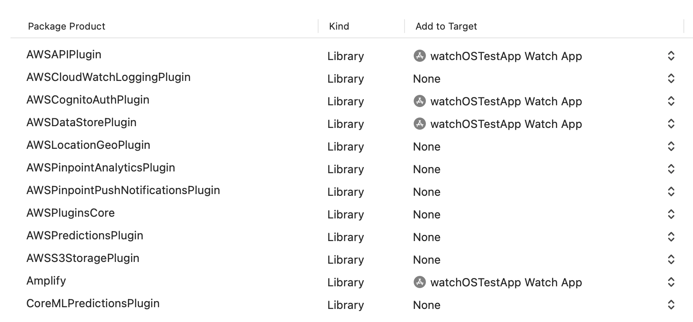

# This app

- Uses DataStore from the branch `fix-watchos` (https://github.com/aws-amplify/aws-appsync-realtime-client-ios/pull/139)
- Ensures Datastore's sync is successful on watchOS.

# If cloning this project

1. Set-up Backend

2. Replace the contents of `amplifyconfiguration.json` with the provisioned backend.

3. Run the app

# Set-up Backend

- `amplify init` 

```
Project information
| Name: watchOSTestApp
| Environment: dev
| Default editor: Visual Studio Code
| App type: ios
```

- `amplify add api`

```
? Select from one of the below mentioned services: GraphQL
? Here is the GraphQL API that we will create. Select a setting to edit or continue Conflict detection (required for DataStore): Disabled
? Enable conflict detection? Yes
? Select the default resolution strategy Auto Merge
? Here is the GraphQL API that we will create. Select a setting to edit or continue Authorization modes: API key (default, expiration time: 7 days from now)
? Choose the default authorization type for the API API key
✔ Enter a description for the API key: · 
✔ After how many days from now the API key should expire (1-365): · 365
? Configure additional auth types? No
? Here is the GraphQL API that we will create. Select a setting to edit or continue Continue
? Choose a schema template: Blank Schema
```

Use the following schema
```
type User @model @auth(rules: [{allow: public}]) {
    id: ID!
    email: String
    tests: [Test] @hasMany(indexName: "byUser", fields: ["id"])
}

type Test @model @auth(rules: [{allow: public}]) {
    id: ID!
    test: String
    userID: ID! @index(name: "byUser")
}
```

- `amplify push` to provision the backend


# Set-up watchOS app (Skip this if cloning this project)





## FAQ

**Issue**: When running `amplify init`, it could not detect the right folder structure of the xcode project. 
```
Updating Xcode project:
🚫 xcodeProject: Target watchOSTestApp not found
-- Recovery suggestion: Manually add Amplify files to your Xcode project.
🛑 Command failed with exit code 1: /Users/xxxx/.amplify/lib/aws-amplify-amplify-frontend-ios/resources/amplify-xcode import-config --path=/Users/xxxx/temp/watchOSTestApp
```

This means we need to make sure the files we need for the app is added to the target. **amplifyconfiguration.json** and files generated from `amplify codegen models`

Generated files are located under `amplify/generated/models`

**amplifyconfiguration.json** located at the root
